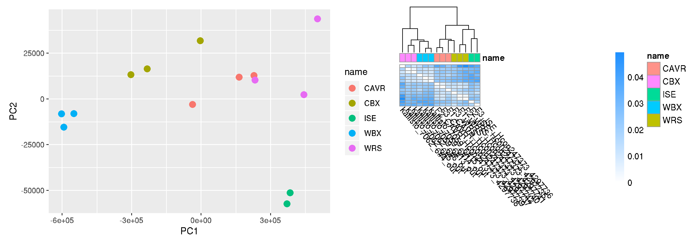

# Reanalysis of GBX RNAseq data on HCON_V4 genome annotations


cd /nfs/users/nfs_s/sd21/lustre118_link/hc/XQTL/03_MAPPING/GILLEARD_BC/RNASEQ/KALLISTO

# load cufflinks, to get gffread
module load cufflinks/2.2.1--py36_2


### Run Kallisto
```shell
cd /nfs/users/nfs_s/sd21/lustre118_link/hc/XQTL/03_MAPPING/GILLEARD_BC/RNASEQ/KALLISTO

# make a transcripts fasta
ln -s ~sd21/lustre118_link/hc/GENOME/TRANSCRIPTOME/TRANSCRIPTOME_CURATION/20200130/UPDATED_annotation.gff3 ANNOTATION.gff3
ln -s ~sd21/lustre118_link/hc/GENOME/REF/HAEM_V4_final.chr.fa REF.fa

gffread -x TRANSCRIPTS.fa -g REF.fa ANNOTATION.gff3


# index the transcripts
kallisto index --index HCON_V4.TRANSCRIPTS.ixd TRANSCRIPTS.fa

# run kallisto
for i in ` cd ../ ; ls -1 *_1.fastq.gz | sed -e "s/_1.fastq.gz//g" `; do \
kallisto quant \
--bias \
--index HCON_V4.TRANSCRIPTS.ixd \
--output-dir kallisto_${i}_out \
--bootstrap-samples 100 \
--threads 7 \
--fusion \
../${i}_1.fastq.gz ../${i}_2.fastq.gz; done

mkdir KALLISTO_MAPPED_SAMPLES
mv kallisto_* KALLISTO_MAPPED_SAMPLES/

```

To run sleuth, a metadata file is needed with all samples IDs, conditions, and paths.
cat sample_name_path.list
sample	name	path
kallisto_7059_6#13_out	WBX	/nfs/users/nfs_s/sd21/lustre118_link/hc/XQTL/03_MAPPING/GILLEARD_BC/RNASEQ/KALLISTO/KALLISTO_MAPPED_SAMPLES/kallisto_7059_6#13_out
kallisto_7059_6#14_out	WBX	/nfs/users/nfs_s/sd21/lustre118_link/hc/XQTL/03_MAPPING/GILLEARD_BC/RNASEQ/KALLISTO/KALLISTO_MAPPED_SAMPLES/kallisto_7059_6#14_out
kallisto_7059_6#15_out	WBX	/nfs/users/nfs_s/sd21/lustre118_link/hc/XQTL/03_MAPPING/GILLEARD_BC/RNASEQ/KALLISTO/KALLISTO_MAPPED_SAMPLES/kallisto_7059_6#15_out
kallisto_7062_6#4_out	CBX	/nfs/users/nfs_s/sd21/lustre118_link/hc/XQTL/03_MAPPING/GILLEARD_BC/RNASEQ/KALLISTO/KALLISTO_MAPPED_SAMPLES/kallisto_7062_6#4_out
kallisto_7062_6#5_out	CBX	/nfs/users/nfs_s/sd21/lustre118_link/hc/XQTL/03_MAPPING/GILLEARD_BC/RNASEQ/KALLISTO/KALLISTO_MAPPED_SAMPLES/kallisto_7062_6#5_out
kallisto_7062_6#6_out	CBX	/nfs/users/nfs_s/sd21/lustre118_link/hc/XQTL/03_MAPPING/GILLEARD_BC/RNASEQ/KALLISTO/KALLISTO_MAPPED_SAMPLES/kallisto_7062_6#6_out
#F1_ISE_Hcon247373_4297734	ISE	/nfs/users/nfs_s/sd21/lustre118_link/hc/XQTL/03_MAPPING/GILLEARD_BC/RNASEQ/KALLISTO/KALLISTO_MAPPED_SAMPLES/kallisto_7554_3#1_out
F2_ISE_Hcon247373_4297735	ISE	/nfs/users/nfs_s/sd21/lustre118_link/hc/XQTL/03_MAPPING/GILLEARD_BC/RNASEQ/KALLISTO/KALLISTO_MAPPED_SAMPLES/kallisto_7554_3#2_out
F3_ISE_Hcon247373_4297736	ISE	/nfs/users/nfs_s/sd21/lustre118_link/hc/XQTL/03_MAPPING/GILLEARD_BC/RNASEQ/KALLISTO/KALLISTO_MAPPED_SAMPLES/kallisto_7554_3#3_out
F1_CAVR_Hcon247373_4297737	CAVR	/nfs/users/nfs_s/sd21/lustre118_link/hc/XQTL/03_MAPPING/GILLEARD_BC/RNASEQ/KALLISTO/KALLISTO_MAPPED_SAMPLES/kallisto_7554_3#4_out
F2_CAVR_Hcon247373_4297738	CAVR	/nfs/users/nfs_s/sd21/lustre118_link/hc/XQTL/03_MAPPING/GILLEARD_BC/RNASEQ/KALLISTO/KALLISTO_MAPPED_SAMPLES/kallisto_7554_3#5_out
F3_CAVR_Hcon247373_4297739	CAVR	/nfs/users/nfs_s/sd21/lustre118_link/hc/XQTL/03_MAPPING/GILLEARD_BC/RNASEQ/KALLISTO/KALLISTO_MAPPED_SAMPLES/kallisto_7554_3#6_out
F1_WRS_Hcon247373_4297740	WRS	/nfs/users/nfs_s/sd21/lustre118_link/hc/XQTL/03_MAPPING/GILLEARD_BC/RNASEQ/KALLISTO/KALLISTO_MAPPED_SAMPLES/kallisto_7554_3#7_out
F2_WRS_Hcon247373_4297741	WRS	/nfs/users/nfs_s/sd21/lustre118_link/hc/XQTL/03_MAPPING/GILLEARD_BC/RNASEQ/KALLISTO/KALLISTO_MAPPED_SAMPLES/kallisto_7554_3#8_out
F3_WRS_Hcon247373_4297742	WRS	/nfs/users/nfs_s/sd21/lustre118_link/hc/XQTL/03_MAPPING/GILLEARD_BC/RNASEQ/KALLISTO/KALLISTO_MAPPED_SAMPLES/kallisto_7554_3#9_out

sample	name	path
kallisto_7059_6#13_out	res	/nfs/users/nfs_s/sd21/lustre118_link/hc/XQTL/03_MAPPING/GILLEARD_BC/RNASEQ/KALLISTO/KALLISTO_MAPPED_SAMPLES/kallisto_7059_6#13_out
kallisto_7059_6#14_out	res	/nfs/users/nfs_s/sd21/lustre118_link/hc/XQTL/03_MAPPING/GILLEARD_BC/RNASEQ/KALLISTO/KALLISTO_MAPPED_SAMPLES/kallisto_7059_6#14_out
kallisto_7059_6#15_out	res	/nfs/users/nfs_s/sd21/lustre118_link/hc/XQTL/03_MAPPING/GILLEARD_BC/RNASEQ/KALLISTO/KALLISTO_MAPPED_SAMPLES/kallisto_7059_6#15_out
kallisto_7062_6#4_out	res	/nfs/users/nfs_s/sd21/lustre118_link/hc/XQTL/03_MAPPING/GILLEARD_BC/RNASEQ/KALLISTO/KALLISTO_MAPPED_SAMPLES/kallisto_7062_6#4_out
kallisto_7062_6#5_out	res	/nfs/users/nfs_s/sd21/lustre118_link/hc/XQTL/03_MAPPING/GILLEARD_BC/RNASEQ/KALLISTO/KALLISTO_MAPPED_SAMPLES/kallisto_7062_6#5_out
kallisto_7062_6#6_out	res	/nfs/users/nfs_s/sd21/lustre118_link/hc/XQTL/03_MAPPING/GILLEARD_BC/RNASEQ/KALLISTO/KALLISTO_MAPPED_SAMPLES/kallisto_7062_6#6_out
F1_ISE_Hcon247373_4297734	ISE	/nfs/users/nfs_s/sd21/lustre118_link/hc/XQTL/03_MAPPING/GILLEARD_BC/RNASEQ/KALLISTO/KALLISTO_MAPPED_SAMPLES/kallisto_7554_3#1_out
F2_ISE_Hcon247373_4297735	ISE	/nfs/users/nfs_s/sd21/lustre118_link/hc/XQTL/03_MAPPING/GILLEARD_BC/RNASEQ/KALLISTO/KALLISTO_MAPPED_SAMPLES/kallisto_7554_3#2_out
F3_ISE_Hcon247373_4297736	ISE	/nfs/users/nfs_s/sd21/lustre118_link/hc/XQTL/03_MAPPING/GILLEARD_BC/RNASEQ/KALLISTO/KALLISTO_MAPPED_SAMPLES/kallisto_7554_3#3_out
F1_CAVR_Hcon247373_4297737	res	/nfs/users/nfs_s/sd21/lustre118_link/hc/XQTL/03_MAPPING/GILLEARD_BC/RNASEQ/KALLISTO/KALLISTO_MAPPED_SAMPLES/kallisto_7554_3#4_out
F2_CAVR_Hcon247373_4297738	res	/nfs/users/nfs_s/sd21/lustre118_link/hc/XQTL/03_MAPPING/GILLEARD_BC/RNASEQ/KALLISTO/KALLISTO_MAPPED_SAMPLES/kallisto_7554_3#5_out
F3_CAVR_Hcon247373_4297739	res	/nfs/users/nfs_s/sd21/lustre118_link/hc/XQTL/03_MAPPING/GILLEARD_BC/RNASEQ/KALLISTO/KALLISTO_MAPPED_SAMPLES/kallisto_7554_3#6_out
F1_WRS_Hcon247373_4297740	res	/nfs/users/nfs_s/sd21/lustre118_link/hc/XQTL/03_MAPPING/GILLEARD_BC/RNASEQ/KALLISTO/KALLISTO_MAPPED_SAMPLES/kallisto_7554_3#7_out
F2_WRS_Hcon247373_4297741	res	/nfs/users/nfs_s/sd21/lustre118_link/hc/XQTL/03_MAPPING/GILLEARD_BC/RNASEQ/KALLISTO/KALLISTO_MAPPED_SAMPLES/kallisto_7554_3#8_out
F3_WRS_Hcon247373_4297742	res	/nfs/users/nfs_s/sd21/lustre118_link/hc/XQTL/03_MAPPING/GILLEARD_BC/RNASEQ/KALLISTO/KALLISTO_MAPPED_SAMPLES/kallisto_7554_3#9_out


# dropped F1_ISE_Hcon247373_4297734 as looked like an outlier, mixed with resistance samples, in PCA plot of all samples

### Load R and environment

```R

R #3.6.1

library("sleuth")
library(ggplot2)
library(patchwork)
```

### Run Sleuth
```R
hc_metadata <- read.table("sample_name_path.list_resVise", header = TRUE, stringsAsFactors=FALSE,comment.char="")
# dropped F1_ISE_Hcon247373_4297734 as looked like an outlier, mixed with resistance samples, in PCA plot of all samples
hc_metadata <- hc_metadata[hc_metadata$sample != "F1_ISE_Hcon247373_4297734",]


hc_so <- sleuth_prep(hc_metadata, extra_bootstrap_summary = TRUE, read_bootstrap_tpm = TRUE)
hc_so <- sleuth_fit(hc_so, ~name, 'full')
hc_so <- sleuth_fit(hc_so, ~1, 'reduced')
hc_so <- sleuth_lrt(hc_so, 'reduced', 'full')

sleuth_table <- sleuth_results(hc_so, 'reduced:full', 'lrt', show_all = FALSE)
sleuth_significant <- dplyr::filter(sleuth_table, qval <= 0.05)
head(sleuth_significant, 20)
```

Generate some plots for QC
```R
pcaplot_allsamples	<-	plot_pca(hc_so, color_by = 'name',point_alpha=1)
heatmap_allsamples   <-    plot_sample_heatmap(hc_so)
kallistoQC_allsamples_plots <- pcaplot_allsamples + heatmap_allsamples + plot_layout(ncol = 2)

ggsave("kallistoQC_allsamples_plots.pdf",width = 28, height = 10, units = "cm")
ggsave("kallistoQC_allsamples_plots.png",width = 28, height = 10, units = "cm")
```
- Copy to local dir - run this from local machine
```shell
scp sd21@pcs5.internal.sanger.ac.uk:/nfs/users/nfs_s/sd21/lustre118_link/hc/XQTL/03_MAPPING/GILLEARD_BC/RNASEQ/KALLISTO/kallistoQC_allsamples_plots.* ~/Documents/informatics_workbook/hcontortus_general/figure
```


Fig - Kalliso QC - GBX samples
